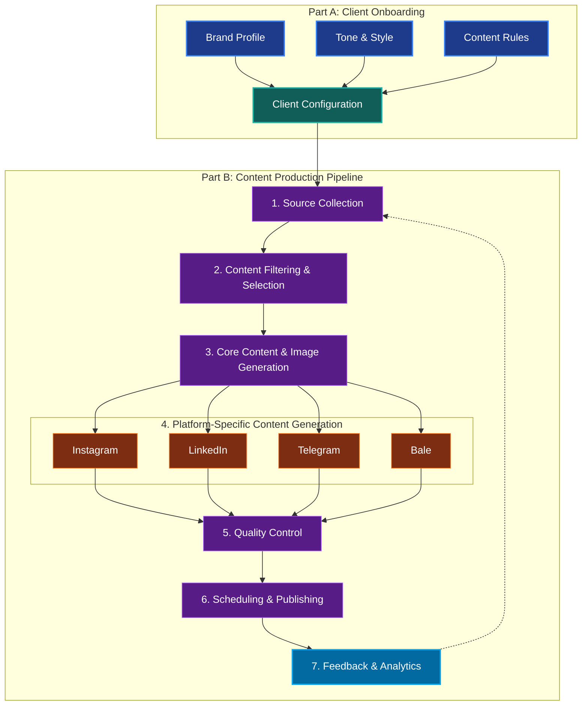

```mermaid
flowchart TD
    subgraph A["Part A: Client Onboarding"]
        BP["Brand Profile"]
        TS["Tone & Style"]
        CR["Content Rules"]

        BP --> CONFIG["Client Configuration"]
        TS --> CONFIG
        CR --> CONFIG
    end

    subgraph B["Part B: Content Production Pipeline"]
        SC["1. Source Collection"]
        CF["2. Content Filtering & Selection"]
        CC["3. Core Content & Image Generation"]

        subgraph PG["4. Platform-Specific Content Generation"]
            IG["Instagram"]
            LI["LinkedIn"]
            TG["Telegram"]
            BL["Bale"]
        end

        QC["5. Quality Control"]
        SP["6. Scheduling & Publishing"]
        FA["7. Feedback & Analytics"]

        SC --> CF
        CF --> CC

        CC --> IG
        CC --> LI
        CC --> TG
        CC --> BL

        IG --> QC
        LI --> QC
        TG --> QC
        BL --> QC

        QC --> SP
        SP --> FA
        FA -.-> SC
    end

    CONFIG --> SC

    classDef onboarding fill:#1e3a8a,stroke:#3b82f6,stroke-width:2px,color:#fff;
    classDef config fill:#115e59,stroke:#14b8a6,stroke-width:2px,color:#fff;
    classDef pipeline fill:#581c87,stroke:#a855f7,stroke-width:1px,color:#fff;
    classDef platform fill:#7c2d12,stroke:#f97316,stroke-width:1px,color:#fff;
    classDef analytics fill:#0369a1,stroke:#0ea5e9,stroke-width:2px,color:#fff;

    class BP,TS,CR onboarding;
    class CONFIG config;
    class SC,CF,CC,QC,SP pipeline;
    class IG,LI,TG,BL platform;
    class FA analytics;
```